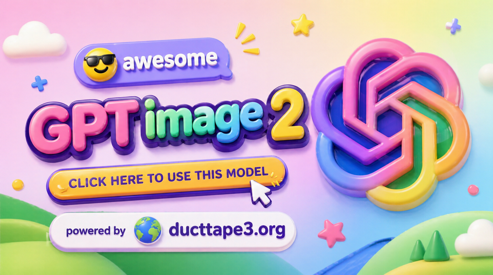

## 簡介

歡迎來到 DuctTape3 的 GPT-Image-2 展示倉庫。

這裡整理了適合靈感查找與工作流參考的 GPT-Image-2 提示詞、輸出結果與視覺案例，方便快速查看不同題材下的生成表現。

下方內容涵蓋人像、海報、角色設定、介面原型與公開實驗案例，可作為 DuctTape3 圖像工作流的參考素材庫。

查看更多工作流與圖像實作內容：[ducttape3.org](https://ducttape3.org/?utm_source=github&utm_medium=readme&utm_campaign=gpt2_images_showcase)

如果這份案例整理對你有幫助，歡迎給個 Star。⭐

> [!NOTE]
> 本倉庫更像是一個持續整理中的提示詞案例展廳，用來沉澱可重用的構圖方向、風格線索與輸出參考。
> 如果你想繼續查看 AI 圖像工具、方法筆記與實戰文章，也可以直接造訪 [ducttape3.org](https://ducttape3.org/?utm_source=github&utm_medium=readme&utm_campaign=gpt2_images_showcase)。

## 最新動態

- **2026 年 4 月 21 日：** 完成 48 個新增案例的分區整理，並補齊對應輸出圖像，方便統一瀏覽與查找
- **2026 年 4 月 21 日：** 補充 12 組新的 GPT-Image-2 參考案例，涵蓋人像、海報、UI 與對比場景
- **2026 年 4 月 20 日：** 新增 10 組精選案例，並同步整理本地圖像資源與說明內容
- **2026 年 4 月 19 日：** 擴充 10 組海報、介面與對比方向的生成示例
- **2026 年 4 月 18 日：** 完成此展示倉庫的首輪整理並正式上線

## 目錄

- [簡介](#簡介)
- [最新動態](#最新動態)
- [人像與攝影案例](#人像與攝影案例)
  - [Case 1: Convenience Store Neon Portrait (by @BubbleBrain)](#case-1-convenience-store-neon-portrait-by-bubblebrain)
  - [Case 2: Cinematic Minimal Portrait (by @iam_miharbi)](#case-2-cinematic-minimal-portrait-by-iam_miharbi)
  - [Case 3: Japanese Onsen Ryokan Portrait (by @BubbleBrain)](#case-3-japanese-onsen-ryokan-portrait-by-bubblebrain)
  - [Case 4: 35mm Flash Editorial Portrait (by @BubbleBrain)](#case-4-35mm-flash-editorial-portrait-by-bubblebrain)
  - [Case 5: Mirror Selfie Bedroom Portrait (by @Shinning1010)](#case-5-mirror-selfie-bedroom-portrait-by-shinning1010)
  - [Case 6: Soft Airy 35mm Portrait (by @BubbleBrain)](#case-6-soft-airy-35mm-portrait-by-bubblebrain)
  - [Case 7: Luxury Glam Beauty Portrait (by @patrickassale)](#case-7-luxury-glam-beauty-portrait-by-patrickassale)
  - [Case 8: 9:16 Cosplayer Portrait Screenshot (by @Zoulinshen)](#case-8-916-cosplayer-portrait-screenshot-by-zoulinshen)
  - [Case 9: Urban Turn-Back Street Portrait (by @Tz_2022)](#case-9-urban-turn-back-street-portrait-by-tz_2022)
  - [Case 10: Sam Altman Skatepark Snapshot (by @Malek1173989)](#case-10-sam-altman-skatepark-snapshot-by-malek1173989)
  - [Case 11: Korean Idol 3x3 Grid Portrait (by @BubbleBrain)](#case-11-korean-idol-3x3-grid-portrait-by-bubblebrain)
  - [Case 12: CCD Camera Flash Korean Idol (by @BubbleBrain)](#case-12-ccd-camera-flash-korean-idol-by-bubblebrain)
  - [Case 13: Korean Idol 3x3 Collage Portrait (by @BubbleBrain)](#case-13-korean-idol-3x3-collage-portrait-by-bubblebrain)
  - [Case 14: Soft Black Mist Editorial Portrait (by @BubbleBrain)](#case-14-soft-black-mist-editorial-portrait-by-bubblebrain)
  - [Case 15: Fujifilm Strawberry School Portrait (by @BubbleBrain)](#case-15-fujifilm-strawberry-school-portrait-by-bubblebrain)
  - [Case 16: Soft Black Mist Idol Portrait (by @BubbleBrain)](#case-16-soft-black-mist-idol-portrait-by-bubblebrain)
  - [Case 17: Fujifilm Couple Portrait (by @BubbleBrain)](#case-17-fujifilm-couple-portrait-by-bubblebrain)
  - [Case 18: AI Self-Perception Portrait (by @80vul)](#case-18-ai-self-perception-portrait-by-80vul)
  - [Case 19: Create the most realistic front page design of a vintage newspaper featuring ... (by @Naiknelofar788)](#case-19-create-the-most-realistic-front-page-design-of-a-vintage-newspaper-featuring-by-naiknelofar788)
  - [Case 20: Magazine Travel Guide Feature Article (by @andis13)](#case-20-magazine-travel-guide-feature-article-by-andis13)
  - [Case 21: analyze this photo and give me a detailed JSON prompt that recreates it. brea... (by @pavellaslov)](#case-21-analyze-this-photo-and-give-me-a-detailed-json-prompt-that-recreates-it-brea-by-pavellaslov)
  - [Case 22: CALMING GREEN TEA Film Kit displayed frontally, the open box shows soft sage-... (by @ZaraIrahh)](#case-22-calming-green-tea-film-kit-displayed-frontally-the-open-box-shows-soft-sage-by-zarairahh)
  - [Case 23: Ultra-realistic product photography of a rich strawberry soft-serve ice cream... (by @ZaraIrahh)](#case-23-ultra-realistic-product-photography-of-a-rich-strawberry-soft-serve-ice-cream-by-zarairahh)
  - [Case 24: A hyper-realistic UI/UX mockup displayed on a slim modern laptop placed on a ... (by @ZaraIrahh)](#case-24-a-hyper-realistic-uiux-mockup-displayed-on-a-slim-modern-laptop-placed-on-a-by-zarairahh)
  - [Case 25: Ultra-realistic cinematic DSLR photograph of an 18-year-old handsome young ma... (by @harboriis)](#case-25-ultra-realistic-cinematic-dslr-photograph-of-an-18-year-old-handsome-young-ma-by-harboriis)
  - [Case 26: Candid Bedroom Selfie Photorealistic Portrait (by @charliejhills)](#case-26-candid-bedroom-selfie-photorealistic-portrait-by-charliejhills)
  - [Case 27: Musician Leaving Bodega Night Cinematic Portrait (by @commanderdgr8)](#case-27-musician-leaving-bodega-night-cinematic-portrait-by-commanderdgr8)
  - [Case 28: Old Delhi Sweet Shop Storefront Documentary Photo (by @commanderdgr8)](#case-28-old-delhi-sweet-shop-storefront-documentary-photo-by-commanderdgr8)
  - [Case 29: Cyberpunk Sci-Fi Side Profile Portrait (by @iamsofiaijaz)](#case-29-cyberpunk-sci-fi-side-profile-portrait-by-iamsofiaijaz)
  - [Case 30: Realistic Candid Bedroom Recording Portrait (by @ChillaiKalan__)](#case-30-realistic-candid-bedroom-recording-portrait-by-chillaikalan__)
  - [Case 31: Toddler Crayon Scribble Art Style Portrait (by @akakageAI)](#case-31-toddler-crayon-scribble-art-style-portrait-by-akakageai)
- [海報與插畫案例](#海報與插畫案例)
  - [Case 1: Boston Spring 2026 City Poster (by @BubbleBrain)](#case-1-boston-spring-2026-city-poster-by-bubblebrain)
  - [Case 2: Vintage Amalfi Travel Poster (by @WolfRiccardo)](#case-2-vintage-amalfi-travel-poster-by-wolfriccardo)
  - [Case 3: Chengdu Food Map Illustration (by @Panda20230902)](#case-3-chengdu-food-map-illustration-by-panda20230902)
  - [Case 4: Chinese Minimalist S-Shaped Poster (by @liyue_ai)](#case-4-chinese-minimalist-s-shaped-poster-by-liyue_ai)
  - [Case 5: 2026 Spring Guangzhou City Poster (by @liyue_ai)](#case-5-2026-spring-guangzhou-city-poster-by-liyue_ai)
  - [Case 7: Doodle Sketch AI Builder (by @blanplan)](#case-7-doodle-sketch-ai-builder-by-blanplan)
  - [Case 8: Futuristic Mandala Illustration (by @4WEB1)](#case-8-futuristic-mandala-illustration-by-4web1)
  - [Case 9: Super Famicom Poster Style (by @lilimliliychan)](#case-9-super-famicom-poster-style-by-lilimliliychan)
  - [Case 10: Browser Game Ad Creative Poster (by @llllegend0620)](#case-10-browser-game-ad-creative-poster-by-llllegend0620)
  - [Case 11: Surreal Koi Nebula Illustration (by @liyue_ai)](#case-11-surreal-koi-nebula-illustration-by-liyue_ai)
  - [Case 12: Ink-Curve Guangzhou Aesthetics Poster (by @liyue_ai)](#case-12-ink-curve-guangzhou-aesthetics-poster-by-liyue_ai)
  - [Case 13: Guangdong Super League Invitation Poster (by @liyue_ai)](#case-13-guangdong-super-league-invitation-poster-by-liyue_ai)
  - [Case 14: Spring 2026 Guangzhou Promo Poster (by @grok)](#case-14-spring-2026-guangzhou-promo-poster-by-grok)
  - [Case 15: Epic Silhouette World Poster (by @Ghhhh3owi)](#case-15-epic-silhouette-world-poster-by-ghhhh3owi)
  - [Case 24: Spring Guangzhou City Poster (by @alanlovelq)](#case-24-spring-guangzhou-city-poster-by-alanlovelq)
  - [Case 26: Qiongqi Eastern Aesthetics Poster (by @liyue_ai)](#case-26-qiongqi-eastern-aesthetics-poster-by-liyue_ai)
  - [Case 27: Guangzhou Paper-Cut City Poster (by @liyue_ai)](#case-27-guangzhou-paper-cut-city-poster-by-liyue_ai)
  - [Case 28: Extreme Perspective Typography Bridge (by @xpg0970)](#case-28-extreme-perspective-typography-bridge-by-xpg0970)
  - [Case 31: Dreamy Watercolor Editorial Illustration (by @hmontilla_)](#case-31-dreamy-watercolor-editorial-illustration-by-hmontilla_)
  - [Case 32: Science Encyclopedia Vertical Poster (by @pfanis)](#case-32-science-encyclopedia-vertical-poster-by-pfanis)
  - [Case 33: Journey to the West Chinese Comic (by @overseas58)](#case-33-journey-to-the-west-chinese-comic-by-overseas58)
  - [Case 34: Character Relationship Map Poster (by @MrLarus)](#case-34-character-relationship-map-poster-by-mrlarus)
  - [Case 35: New Chinese Ink Landscape Poster (by @liyue_ai)](#case-35-new-chinese-ink-landscape-poster-by-liyue_ai)
  - [Case 36: AI Builder Doodle Sketch (by @opc_8838)](#case-36-ai-builder-doodle-sketch-by-opc_8838)
  - [Case 38: Character Visual Vertical Poster (by @tebasaki3D)](#case-38-character-visual-vertical-poster-by-tebasaki3d)
  - [Case 39: Science Encyclopedia Infographic (by @MrLarus)](#case-39-science-encyclopedia-infographic-by-mrlarus)
  - [Case 40: Fictional Anime Movie Poster (by @seiiiiiiiiiiru)](#case-40-fictional-anime-movie-poster-by-seiiiiiiiiiiru)
  - [Case 41: Product Ad Redesign (by @genel_ai)](#case-41-product-ad-redesign-by-genel_ai)
  - [Case 42: Dark-Fantasy Guangzhou City Poster (by @liyue_ai)](#case-42-dark-fantasy-guangzhou-city-poster-by-liyue_ai)
  - [Case 45: Science Fiction Movie Poster (by @underwoodxie96)](#case-45-science-fiction-movie-poster-by-underwoodxie96)
  - [Case 46: Refreshing Summer Udon Ad (by @genel_ai)](#case-46-refreshing-summer-udon-ad-by-genel_ai)
  - [Case 47: Handwritten Medical Prescription Sheet (by @MrLarus)](#case-47-handwritten-medical-prescription-sheet-by-mrlarus)
  - [Case 48: Silicon Valley 2026 Promo Poster (by @carsonyungos)](#case-48-silicon-valley-2026-promo-poster-by-carsonyungos)
  - [Case 49: Japanese Supermarket Sale Flyer (by @weel_corp)](#case-49-japanese-supermarket-sale-flyer-by-weel_corp)
  - [Case 50: Dark Epic Concept Poster (by @A9Quant)](#case-50-dark-epic-concept-poster-by-a9quant)
  - [Case 51: Pilates Studio Ad Poster (by @ck_igarashi)](#case-51-pilates-studio-ad-poster-by-ck_igarashi)
  - [Case 52: 6-Block Fashion Campaign Prompt Formula (by @anacoding)](#case-52-6-block-fashion-campaign-prompt-formula-by-anacoding)
  - [Case 53: Sony A7 Exploded View Breakdown Prompt (by @iaPulse_)](#case-53-sony-a7-exploded-view-breakdown-prompt-by-iapulse_)
  - [Case 54: 1900 Istiklal Street Panorama Prompt (by @ai_gezgini)](#case-54-1900-istiklal-street-panorama-prompt-by-ai_gezgini)
  - [Case 57: Theme Science Encyclopedia Card (by @alanlovelq)](#case-57-theme-science-encyclopedia-card-by-alanlovelq)
  - [Case 55: Chili Pork Cooking Flowchart (by @Kurt_Rousey466)](#case-55-chili-pork-cooking-flowchart-by-kurt_rousey466)
  - [Case 56: Cinematic Infographic Concept Poster (by @A9Quant)](#case-56-cinematic-infographic-concept-poster-by-a9quant)
  - [Case 58: A full-body outdoor shot captures a young Caucasian woman, possibly in her la... (by @AIwithSarah_)](#case-58-a-full-body-outdoor-shot-captures-a-young-caucasian-woman-possibly-in-her-la-by-aiwithsarah_)
  - [Case 59: A professional product photography shot of a cold sparkling water (by @meng_dagg695)](#case-59-a-professional-product-photography-shot-of-a-cold-sparkling-water-by-meng_dagg695)
  - [Case 60: 360 Equirectangular Panorama Image (by @rs_elwood)](#case-60-360-equirectangular-panorama-image-by-rs_elwood)
  - [Case 61: Soft poetic children's book illustration with watercolor and gouache textures... (by @dotey)](#case-61-soft-poetic-childrens-book-illustration-with-watercolor-and-gouache-textures-by-dotey)
  - [Case 62: Aspect Ratio: 9:16 Vertical (by @GeekCatX)](#case-62-aspect-ratio-916-vertical-by-geekcatx)
  - [Case 63: Hangzhou West Lake Travel Poster (by @BNBOKBt5)](#case-63-hangzhou-west-lake-travel-poster-by-bnbokbt5)
  - [Case 64: Dongfang Bubai Wuxia Character Poster (by @songguoxiansen)](#case-64-dongfang-bubai-wuxia-character-poster-by-songguoxiansen)
  - [Case 65: A Chinese Odyssey 90s Hong Kong Poster (by @songguoxiansen)](#case-65-a-chinese-odyssey-90s-hong-kong-poster-by-songguoxiansen)
  - [Case 66: Journey to the West Daughter Kingdom Poster (by @cj858cjsoul)](#case-66-journey-to-the-west-daughter-kingdom-poster-by-cj858cjsoul)
  - [Case 67: Royal Tramp Character Poster (by @caiziboshi)](#case-67-royal-tramp-character-poster-by-caiziboshi)
  - [Case 68: generate an image of a racing car poster with its spec and pricing (by @verysmallwoods)](#case-68-generate-an-image-of-a-racing-car-poster-with-its-spec-and-pricing-by-verysmallwoods)
  - [Case 69: Charlie Chaplin Product Poster Redesign (by @chenenpei)](#case-69-charlie-chaplin-product-poster-redesign-by-chenenpei)
  - [Case 70: Luxury Sportswear Basketball Athlete Campaign Poster (by @Shorelyn_)](#case-70-luxury-sportswear-basketball-athlete-campaign-poster-by-shorelyn_)
  - [Case 71: Streetwear Fashion Campaign Asian Apparel Poster (by @harboriis)](#case-71-streetwear-fashion-campaign-asian-apparel-poster-by-harboriis)
  - [Case 72: Epic Career Moments Cinematic Poster Template (by @Goodmanprotocol)](#case-72-epic-career-moments-cinematic-poster-template-by-goodmanprotocol)
  - [Case 73: Avant-Garde Basketball Sculpture Sports Fashion Ad (by @AIwithkhan)](#case-73-avant-garde-basketball-sculpture-sports-fashion-ad-by-aiwithkhan)
  - [Case 74: Avant-Garde Tennis Racket Sculpture Sports Fashion Ad (by @AIwithSynthia)](#case-74-avant-garde-tennis-racket-sculpture-sports-fashion-ad-by-aiwithsynthia)
  - [Case 75: Surrealist Liquor Brand High Fashion Poster (by @hmontilla_)](#case-75-surrealist-liquor-brand-high-fashion-poster-by-hmontilla_)
  - [Case 76: Premium Food Recipe Poster Elegant Layout (by @Preda2005)](#case-76-premium-food-recipe-poster-elegant-layout-by-preda2005)
  - [Case 77: Luxury Fashion Magazine Cover Black and White (by @iamrealsnow)](#case-77-luxury-fashion-magazine-cover-black-and-white-by-iamrealsnow)
  - [Case 78: Surrealist Rolex Luxury Watch Fashion Poster (by @Sheldon056)](#case-78-surrealist-rolex-luxury-watch-fashion-poster-by-sheldon056)
  - [Case 79: Peacock Botanical Vintage Symmetrical Art Print (by @dotey)](#case-79-peacock-botanical-vintage-symmetrical-art-print-by-dotey)
  - [Case 80: SPLASH Fashion Brand Hyper-Realistic Campaign Poster (by @miratechtool)](#case-80-splash-fashion-brand-hyper-realistic-campaign-poster-by-miratechtool)
  - [Case 81: Avant-Garde Guitar Sculpture Fashion Advertisement (by @QamarRiaz1)](#case-81-avant-garde-guitar-sculpture-fashion-advertisement-by-qamariiaz1)
- [角色設計案例](#角色設計案例)
  - [Case 1: Anime Snapshot Conversion (by @Thereallo1026)](#case-1-anime-snapshot-conversion-by-thereallo1026)
  - [Case 2: Persona5 Character Reference Card (by @iamrednightS)](#case-2-persona5-character-reference-card-by-iamrednights)
  - [Case 3: Gal Game Character Introduction Page (by @09lyco)](#case-3-gal-game-character-introduction-page-by-09lyco)
  - [Case 5: Official Character Sheet (JP) (by @Toshi_nyaruo_AI)](#case-5-official-character-sheet-jp-by-toshi_nyaruo_ai)
  - [Case 7: Mecha Girl Sea-City Key Visual (by @old_pgmrs_will)](#case-7-mecha-girl-sea-city-key-visual-by-old_pgmrs_will)
  - [Case 8: Saint Seiya Gold Saints Card Grid (by @songguoxiansen)](#case-8-saint-seiya-gold-saints-card-grid-by-songguoxiansen)
  - [Case 9: Chaos Notes Hidden Face Character Art (by @loglogrog)](#case-9-chaos-notes-hidden-face-character-art-by-loglogrog)
- [UI 與社群媒體截圖案例](#ui-與社群媒體截圖案例)
  - [Case 1: One-Prompt UI Design Generation (by @austinit)](#case-1-one-prompt-ui-design-generation-by-austinit)
  - [Case 2: Amateur iPhone Keynote Snapshot (by @patrickassale)](#case-2-amateur-iphone-keynote-snapshot-by-patrickassale)
  - [Case 3: Handwritten Notebook Photo (by @patrickassale)](#case-3-handwritten-notebook-photo-by-patrickassale)
  - [Case 4: Song Dynasty Social Media Feed (by @Panda20230902)](#case-4-song-dynasty-social-media-feed-by-panda20230902)
  - [Case 5: Multi-Platform Content Screenshots (by @MrLarus)](#case-5-multi-platform-content-screenshots-by-mrlarus)
  - [Case 7: Liu Yifei Douyin Livestream Screenshot (by @alanblogsooo)](#case-7-liu-yifei-douyin-livestream-screenshot-by-alanblogsooo)
  - [Case 8: King Taejo Yi Seong-gye's X Page (by @SKA_Neotype)](#case-8-king-taejo-yi-seong-gyes-x-page-by-ska_neotype)
  - [Case 9: Style-to-UI Design System (by @stark_nico99)](#case-9-style-to-ui-design-system-by-stark_nico99)
  - [Case 10: Momotaro Explainer Slide (by @yammamon)](#case-10-momotaro-explainer-slide-by-yammamon)
  - [Case 25: Museum-Style Hanfu Breakdown Infographic (by @MrLarus)](#case-25-museum-style-hanfu-breakdown-infographic-by-mrlarus)
  - [Case 26: Glassy UI Design System (by @pfanis)](#case-26-glassy-ui-design-system-by-pfanis)
  - [Case 27: Japanese RPG Status Screen (by @Kashiko_AIart)](#case-27-japanese-rpg-status-screen-by-kashiko_aiart)
  - [Case 28: Xuanwu Gate Social Feed (by @Tz_2022)](#case-28-xuanwu-gate-social-feed-by-tz_2022)
  - [Case 29: City Travel Guide Infographic (by @MrLarus)](#case-29-city-travel-guide-infographic-by-mrlarus)
  - [Case 30: 3D X Profile Mockup (by @GoSailGlobal)](#case-30-3d-x-profile-mockup-by-gosailglobal)
  - [Case 31: Empress Dowager Cixi X Page (by @Cryptohaifeng_)](#case-31-empress-dowager-cixi-x-page-by-cryptohaifeng_)
  - [Case 32: Palm Reading Diagnosis Report (by @agi_aibusi)](#case-32-palm-reading-diagnosis-report-by-agi_aibusi)
  - [Case 33: Calligraphy Copybook Sheet (by @MrLarus)](#case-33-calligraphy-copybook-sheet-by-mrlarus)
  - [Case 34: Don Quijote Promo Pop Poster (by @loglogrog)](#case-34-don-quijote-promo-pop-poster-by-loglogrog)
  - [Case 35: Japanese Gacha Game Screen (by @the_wheel_2024)](#case-35-japanese-gacha-game-screen-by-the_wheel_2024)
  - [Case 36: Elon Musk Douyin Livestream Screenshot (by @Shinning1010)](#case-36-elon-musk-douyin-livestream-screenshot-by-shinning1010)
  - [Case 37: Liu Yifei Douyin Livestream Screenshot (by @kylegeeks)](#case-37-liu-yifei-douyin-livestream-screenshot-by-kylegeeks)
  - [Case 38: Cyberpunk Neon UI Design System (by @AZLnfvp)](#case-38-cyberpunk-neon-ui-design-system-by-azlnfvp)
  - [Case 39: Trump and Kim Livestream PK Screenshot (by @alanlovelq)](#case-39-trump-and-kim-livestream-pk-screenshot-by-alanlovelq)
  - [Case 40: Japanese AI Game Dev Overview Slide Prompt (by @ailovedirector)](#case-40-japanese-ai-game-dev-overview-slide-prompt-by-ailovedirector)
  - [Case 41: based on the generated character help me generate a screenshot of screenshot ... (by @khaiinit)](#case-41-based-on-the-generated-character-help-me-generate-a-screenshot-of-screenshot-by-khaiinit)
  - [Case 42: Create a landing page using this image as a reference for style and color gra... (by @D_studioproject)](#case-42-create-a-landing-page-using-this-image-as-a-reference-for-style-and-color-gra-by-d_studioproject)
  - [Case 43: Li Jiaqi Lipstick Livestream Background (by @songguoxiansen)](#case-43-li-jiaqi-lipstick-livestream-background-by-songguoxiansen)
  - [Case 44: Apple Pods Pro 3 Headphone E-Commerce Infographic (by @meng_dagg695)](#case-44-apple-pods-pro-3-headphone-e-commerce-infographic-by-meng_dagg695)
  - [Case 45: Apple Pods Pro 3 Earbuds E-Commerce Infographic (by @rovvmut_)](#case-45-apple-pods-pro-3-earbuds-e-commerce-infographic-by-rovvmut_)
  - [Case 46: Beauty Product Commercial Marketing Photograph (by @AIwithSarah_)](#case-46-beauty-product-commercial-marketing-photograph-by-aiwithsarah_)
  - [Case 47: AAA Video Game Screenshot Concept Design (by @ChiefMonkeyMike)](#case-47-aaa-video-game-screenshot-concept-design-by-chiefmonkeymike)
- [模型比較與社群案例](#模型比較與社群案例)
  - [Case 5: Wooden Bookshelf Prompt Test (by @chetaslua)](#case-5-wooden-bookshelf-prompt-test-by-chetaslua)
  - [Case 10: GPT-Image-2 Detail Showcase (by @liyue_ai)](#case-10-gpt-image-2-detail-showcase-by-liyue_ai)
  - [Case 16: A/B Test Signed Output (by @saskr_13)](#case-16-ab-test-signed-output-by-saskr_13)
  - [Case 23: Silhouette Universe Narrative Poster (by @MrLarus)](#case-23-silhouette-universe-narrative-poster-by-mrlarus)
  - [Case 29: Lion Camel Ridge Dark Myth Scene (by @MANISH1027512)](#case-29-lion-camel-ridge-dark-myth-scene-by-manish1027512)
  - [Case 30: Counter-Strike x Terraria Screenshot Mashup (by @yssrski)](#case-30-counter-strike-x-terraria-screenshot-mashup-by-yssrski)
  - [Case 31: Pre-war Japan Lab Minecraft Screenshot (by @RitaStar1128)](#case-31-pre-war-japan-lab-minecraft-screenshot-by-ritastar1128)
  - [Case 32: Forged Masterpiece Prompt Test (by @MrLarus)](#case-32-forged-masterpiece-prompt-test-by-mrlarus)
  - [Case 33: Multi-Concept Battle Poster Set (by @joshesye)](#case-33-multi-concept-battle-poster-set-by-joshesye)
  - [Case 34: Rust In-Game Screenshot (by @FixlationAI)](#case-34-rust-in-game-screenshot-by-fixlationai)
  - [Case 35: Sam Altman Bear Selfie (by @JustinGorya)](#case-35-sam-altman-bear-selfie-by-justingorya)
  - [Case 36: Among Us Realistic Screenshot (by @ReYYYYoking)](#case-36-among-us-realistic-screenshot-by-reyyyyoking)
  - [Case 37: Retro Programming Museum Cartoon (by @XiaohuiAI666)](#case-37-retro-programming-museum-cartoon-by-xiaohuiai666)
  - [Case 38: 14th-Dimension Projection Scene (by @workingclassbud)](#case-38-14th-dimension-projection-scene-by-workingclassbud)
  - [Case 39: Sam Altman Baseball Broadcast (by @16kthir0GRXgNqn)](#case-39-sam-altman-baseball-broadcast-by-16kthir0grxgnqn)
  - [Case 40: Based on the video content and this current frame, use GPT to generate a YouT... (by @chatcutapp)](#case-40-based-on-the-video-content-and-this-current-frame-use-gpt-to-generate-a-yout-by-chatcutapp)
  - [Case 41: Generate an image of the most significant event of 2020 (by @Rufus87078959)](#case-41-generate-an-image-of-the-most-significant-event-of-2020-by-rufus87078959)
  - [Case 42: Edit this image so that total amount changes to 244.5 baht. You can change th... (by @elliscrosby)](#case-42-edit-this-image-so-that-total-amount-changes-to-2445-baht-you-can-change-th-by-elliscrosby)
  - [Case 43: Generate an image of the most significant event of 2001 (by @Rufus87078959)](#case-43-generate-an-image-of-the-most-significant-event-of-2001-by-rufus87078959)
  - [Case 44: Generate an image of the most significant event of 2025. (by @Rufus87078959)](#case-44-generate-an-image-of-the-most-significant-event-of-2025-by-rufus87078959)
  - [Case 45: Personal Profile Infographic Generator (by @andis13)](#case-45-personal-profile-infographic-generator-by-andis13)
  - [Case 46: 360 Equirectangular Panorama Image (by @rs_elwood)](#case-46-360-equirectangular-panorama-image-by-rs_elwood)
  - [Case 47: Personal Knowledge Infographic Portrait (by @aitorwilzig)](#case-47-personal-knowledge-infographic-portrait-by-aitorwilzig)
  - [Case 48: Research LIME Drug Design and make a detailed infographic about it (by @WillSpagnoli)](#case-48-research-lime-drug-design-and-make-a-detailed-infographic-about-it-by-willspagnoli)
  - [Case 49: Douyin Livestream Sales Screenshot (by @laogeai)](#case-49-douyin-livestream-sales-screenshot-by-laogeai)
  - [Case 50: Social App Match Success Screen (by @songguoxiansen)](#case-50-social-app-match-success-screen-by-songguoxiansen)
  - [Case 51: Lu Bu Boss Design Sheet (by @songguoxiansen)](#case-51-lu-bu-boss-design-sheet-by-songguoxiansen)
  - [Case 52: Nezha Dark Fantasy Novel Cover (by @songguoxiansen)](#case-52-nezha-dark-fantasy-novel-cover-by-songguoxiansen)
  - [Case 53: New Chinese Minimalist Floral Illustration (by @liyue_ai)](#case-53-new-chinese-minimalist-floral-illustration-by-liyue_ai)
  - [Case 54: Su Daji Ancient-Style Glamour Portrait (by @nidiedeba)](#case-54-su-daji-ancient-style-glamour-portrait-by-nidiedeba)
  - [Case 55: Lu Xun Morning Flowers Illustration (by @Aurora_62340)](#case-55-lu-xun-morning-flowers-illustration-by-aurora_62340)
  - [Case 56: Subway Candid Phone Snapshot (by @AntCaveClub)](#case-56-subway-candid-phone-snapshot-by-antcaveclub)
  - [Case 57: China Aerospace Commemorative Stamp Sheet (by @songguoxiansen)](#case-57-china-aerospace-commemorative-stamp-sheet-by-songguoxiansen)
  - [Case 58: Vertical Wuxia Heroine Portrait (by @CoderDaMing)](#case-58-vertical-wuxia-heroine-portrait-by-coderdaming)
  - [Case 59: Realistic Guanyin Portrait from Buddhist Texts (by @Zhaoge01)](#case-59-realistic-guanyin-portrait-from-buddhist-texts-by-zhaoge01)
  - [Case 60: Tang Dynasty Chang'an Lantern Festival Panorama (by @songguoxiansen)](#case-60-tang-dynasty-changan-lantern-festival-panorama-by-songguoxiansen)
  - [Case 61: Historical Yang Guifei Realistic Portrait (by @Zhaoge01)](#case-61-historical-yang-guifei-realistic-portrait-by-zhaoge01)
  - [Case 62: Surreal Japanese Futuristic City Illustration (by @Tresmort)](#case-62-surreal-japanese-futuristic-city-illustration-by-tresmort)
  - [Case 63: Tushan Yaya Fantasy Glamour Portrait (by @sdjn_wgc)](#case-63-tushan-yaya-fantasy-glamour-portrait-by-sdjn_wgc)
  - [Case 64: Douyin Livestream Sales Screenshot (by @LVWANGJI_0327)](#case-64-douyin-livestream-sales-screenshot-by-lvwangji_0327)
  - [Case 65: Eastern Fantasy Female Half-Portrait (by @liyue_ai)](#case-65-eastern-fantasy-female-half-portrait-by-liyue_ai)
  - [Case 66: Vertical Artistic Portrait of a Young Eastern Woman (by @zhiyangzhu22222)](#case-66-vertical-artistic-portrait-of-a-young-eastern-woman-by-zhiyangzhu22222)
  - [Case 67: Autobots Assembled at Lunar Base (by @songguoxiansen)](#case-67-autobots-assembled-at-lunar-base-by-songguoxiansen)
  - [Case 68: Naturalist-Style Food Specimen Cross-Section (by @GeekCatX)](#case-68-naturalist-style-food-specimen-cross-section-by-geekcatx)
  - [Case 69: Polaroid Frame Breakout Scene (by @MajaDesignJP)](#case-69-polaroid-frame-breakout-scene-by-majadesignjp)
  - [Case 70: 2D Anime Character Real-World Grid Scenes (by @seiiiiiiiiiiru)](#case-70-2d-anime-character-real-world-grid-scenes-by-seiiiiiiiiiiru)
  - [Case 71: Poster-to-Trailer Concept Prompt (by @os_shim)](#case-71-poster-to-trailer-concept-prompt-by-os_shim)
  - [Case 72: Rubber Duck Boy Live-Action Movie Poster (by @mirai_ai2050)](#case-72-rubber-duck-boy-live-action-movie-poster-by-mirai_ai2050)
  - [Case 73: Tomato E-Commerce Product Image Set (by @Adam38363368936)](#case-73-tomato-e-commerce-product-image-set-by-adam38363368936)
- [致謝](#致謝)

## 致謝

本倉庫內容整理自公開可見的 GPT-Image-2 創作案例、提示詞分享與社群實驗紀錄。

感謝所有願意公開發布作品、提示詞與輸出結果的創作者，讓這份案例集可以持續完善。

[@BubbleBrain](https://x.com/BubbleBrain)、[@iam_miharbi](https://x.com/iam_miharbi)、[@Shinning1010](https://x.com/Shinning1010)、[@patrickassale](https://x.com/patrickassale)、[@Zoulinshen](https://x.com/Zoulinshen)、[@WolfRiccardo](https://x.com/WolfRiccardo)、[@Panda20230902](https://x.com/Panda20230902)、[@liyue_ai](https://x.com/liyue_ai)、[@blanplan](https://x.com/blanplan)、[@4WEB1](https://x.com/4WEB1)、[@lilimliliychan](https://x.com/lilimliliychan)、[@Thereallo1026](https://x.com/Thereallo1026)、[@iamrednightS](https://x.com/iamrednightS)、[@09lyco](https://x.com/09lyco)、[@tsubaki_ew](https://x.com/tsubaki_ew)、[@Toshi_nyaruo_AI](https://x.com/Toshi_nyaruo_AI)、[@yyu_hase](https://x.com/yyu_hase)、[@austinit](https://x.com/austinit)、[@MrLarus](https://x.com/MrLarus)、[@rionaifantasy](https://x.com/rionaifantasy)、[@alanblogsooo](https://x.com/alanblogsooo)、[@SKA_Neotype](https://x.com/SKA_Neotype)、[@desds1678](https://x.com/desds1678)、[@samifox_ai](https://x.com/samifox_ai)、[@HuliJason](https://x.com/HuliJason)、[@MikelEcheve](https://x.com/MikelEcheve)、[@chetaslua](https://x.com/chetaslua)、[@signedbywill](https://x.com/signedbywill)、[@zerolu_eth](https://x.com/zerolu_eth)、[@Cheney_NehcOal](https://x.com/Cheney_NehcOal)、[@cnzoecomeback](https://x.com/cnzoecomeback)、[@linxiaobei888](https://x.com/linxiaobei888)、[@old_pgmrs_will](https://x.com/old_pgmrs_will)、[@kotsu_kotsu_san](https://x.com/kotsu_kotsu_san)、[@samayousakadaru](https://x.com/samayousakadaru)、[@saskr_13](https://x.com/saskr_13)、[@kawai_design](https://x.com/kawai_design)、[@otohitoyuuki](https://x.com/otohitoyuuki)、[@jrpj2010](https://x.com/jrpj2010)、[@CEs7J0Mfn8x37k5](https://x.com/CEs7J0Mfn8x37k5)、[@pfanis](https://x.com/pfanis)、[@yssrski](https://x.com/yssrski)、[@overseas58](https://x.com/overseas58)、[@opc_8838](https://x.com/opc_8838)、[@RitaStar1128](https://x.com/RitaStar1128)、[@Yuupapa_free](https://x.com/Yuupapa_free)、[@tebasaki3D](https://x.com/tebasaki3D)

*我們仍在持續核對部分案例的來源歸屬。如果你發現署名、連結或內容需要修正，歡迎聯絡我們處理。*

想繼續查看更多 AI 圖像工作流、提示詞拆解與實作文章，可以造訪 [ducttape3.org](https://ducttape3.org/?utm_source=github&utm_medium=readme&utm_campaign=gpt2_images_showcase)。
